# Community

开源社区项目，采用前后端分离结构，可运行于微信小程序、H5、Android 和 iOS，并提供独立的商户管理后台。

本仓库提供可独立部署的单社区论坛业务。SaaS 平台、租户开通、套餐、计费、配额、商业授权和跨租户运营能力属于私有商业增强版，不在本开源仓库中维护。

## 项目结构

```text
community/
├── admin/      # Vue 3 商户管理后台
├── frontend/   # uni-app 用户端（小程序、H5、APP）
├── backend/    # Spring Boot 业务服务
├── docs/       # 开源业务架构、接口和部署文档
└── sql/        # 开源业务数据库脚本
```

## 界面预览

### 用户端

同一套 `uni-app` 源码可发布为微信小程序、H5、Android 和 iOS APP。

<table>
  <tr>
    <td align="center"><br><strong>社区首页</strong></td>
    <td align="center">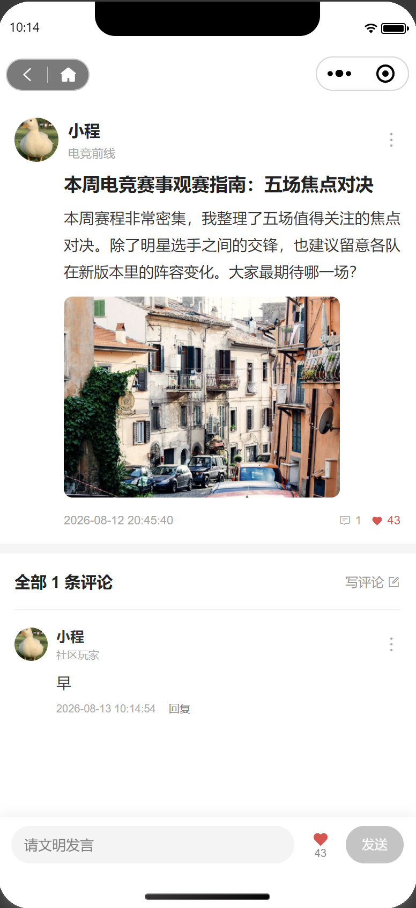<br><strong>帖子详情与评论</strong></td>
  </tr>
  <tr>
    <td align="center">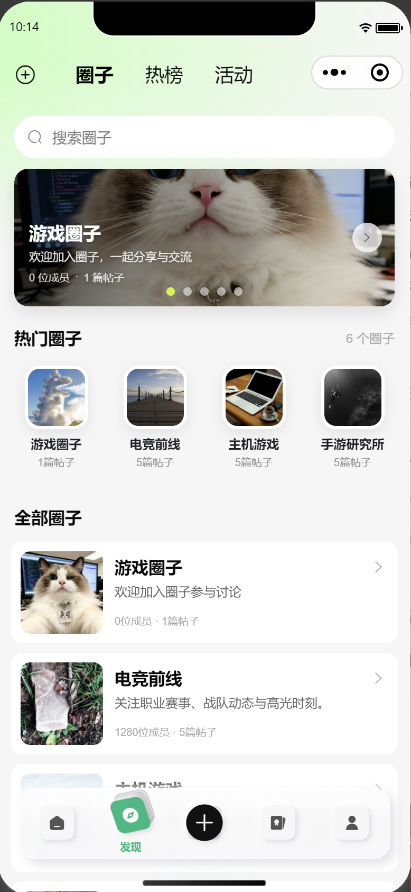<br><strong>圈子发现</strong></td>
    <td align="center">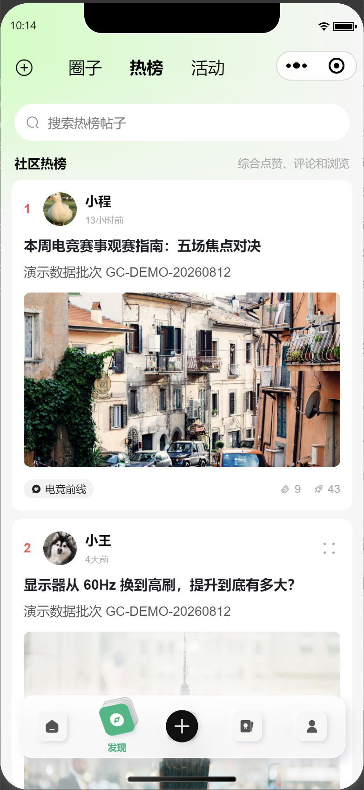<br><strong>社区热榜</strong></td>
  </tr>
  <tr>
    <td align="center">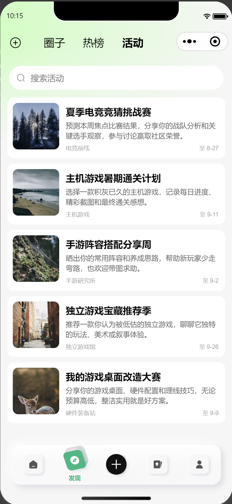<br><strong>社区活动</strong></td>
    <td align="center">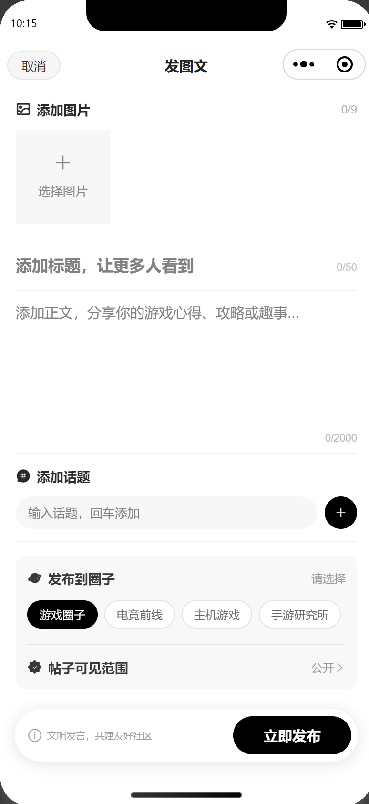<br><strong>图文发布</strong></td>
  </tr>
  <tr>
    <td align="center">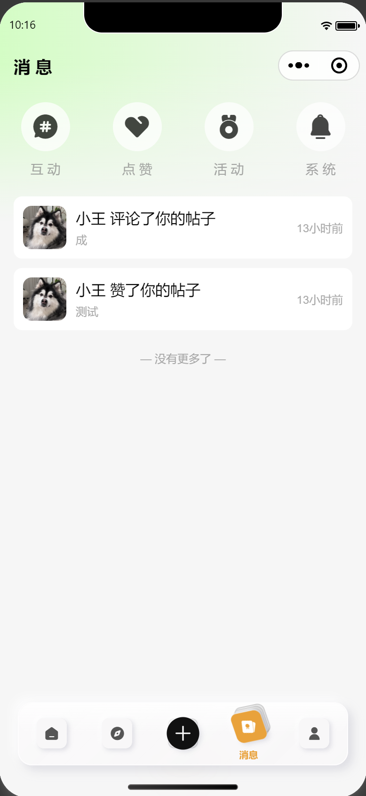<br><strong>消息中心</strong></td>
    <td align="center">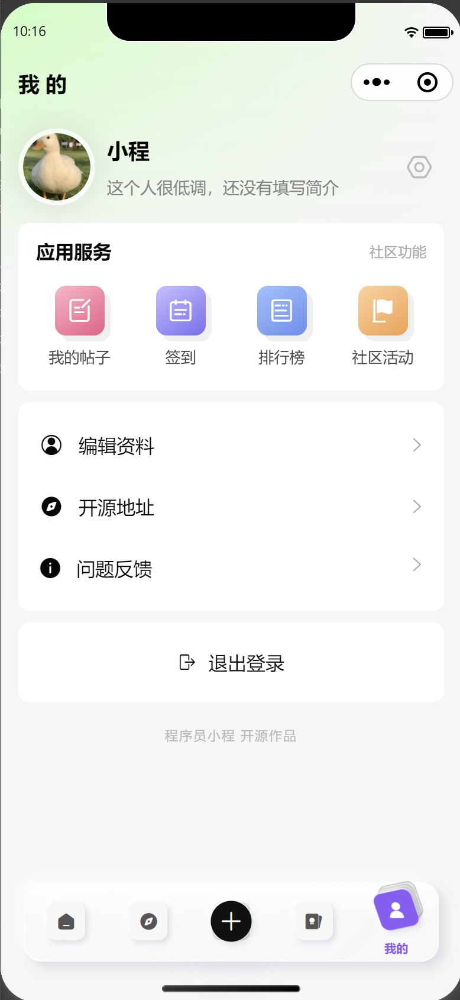<br><strong>个人中心</strong></td>
  </tr>
</table>

### 商户管理后台

<p align="center">
  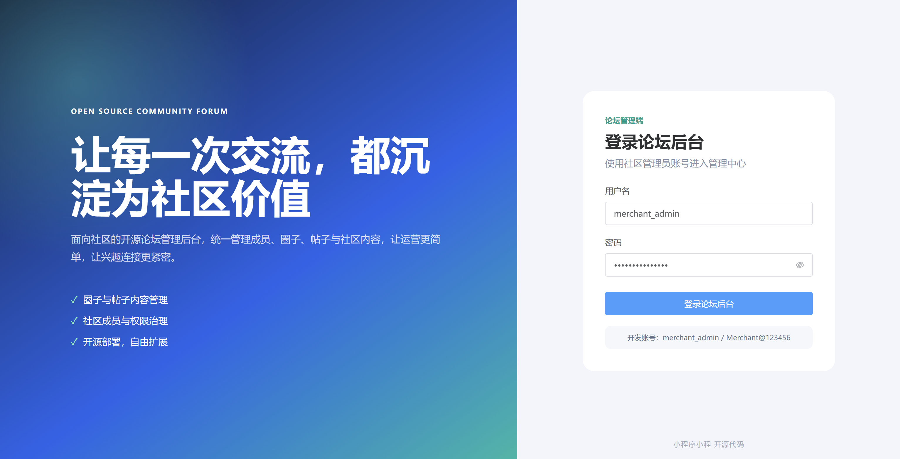
  <br><strong>商户管理后台登录</strong>
</p>

<p align="center">
  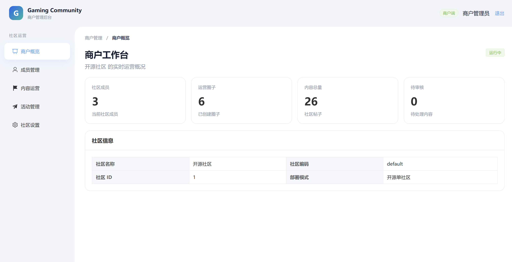
  <br><strong>商户运营概览</strong>
</p>

<p align="center">
  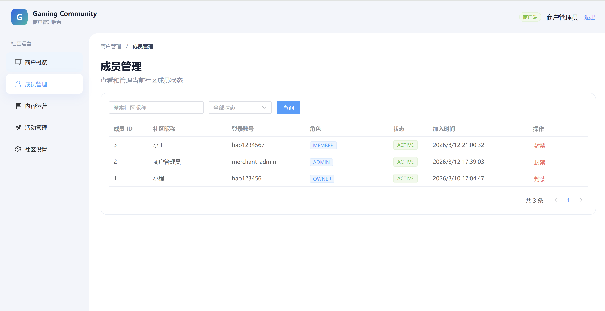
  <br><strong>成员管理</strong>
</p>

<p align="center">
  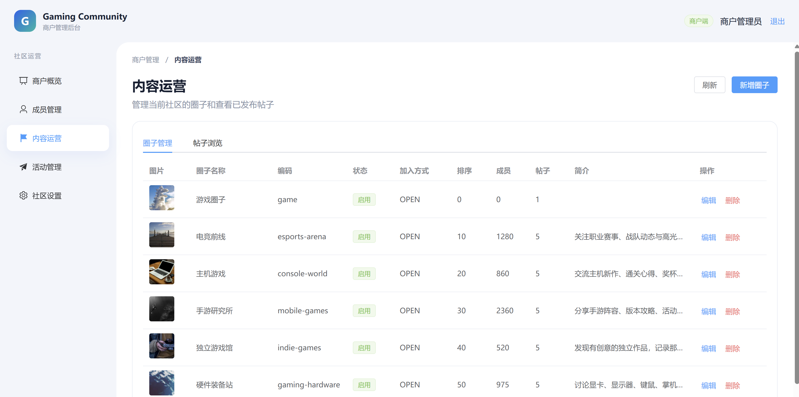
  <br><strong>圈子与帖子运营</strong>
</p>

<p align="center">
  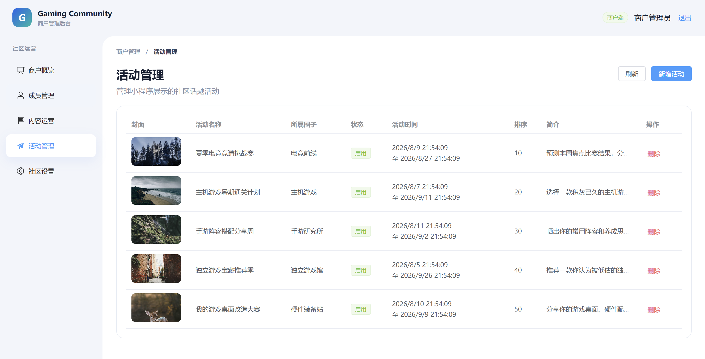
  <br><strong>活动管理</strong>
</p>

## 开源社区功能清单

### 账号与社区

- 账号注册、密码登录、刷新令牌和退出登录
- 未登录访问保护：评论、点赞等互动会引导至登录页，登录后返回原页面
- 当前社区初始化、社区名称和圈子切换
- 当前用户资料查询与编辑、头像上传、默认头像
- 用户主页、用户帖子列表和获赞统计

### 内容与互动

- 首页推荐、最新、热门帖子流
- 圈子列表、圈子轮播、圈子筛选和圈子详情数据
- 社区热榜和帖子搜索
- 活动/话题列表
- 图文帖子发布、圈子选择、标签和最多 9 张图片上传
- 帖子详情、评论列表和发表评论
- 点赞与取消点赞
- 我的帖子列表和删除帖子
- 举报帖子、屏蔽成员

### 社区服务

- 每日签到、连续签到、积分与最近签到记录
- 消息汇总、互动/点赞/活动/系统消息、单条已读和全部已读
- 我的页面、开源地址、问题反馈和登录状态管理
- 自定义底部导航与中间快捷发布

### 商户管理后台

- 管理员登录与权限路由
- 商户运营概览和社区数据统计
- 社区成员、状态和角色管理
- 圈子管理和帖子浏览
- 活动管理
- 社区基础设置

后台只管理当前开源社区，不提供跨租户平台能力。

### 多端支持

| 能力 | 微信小程序 | H5 | Android / iOS APP |
| --- | --- | --- | --- |
| 注册登录、社区、帖子、评论、点赞 | 支持 | 支持 | 支持 |
| 图片选择与 OSS 上传 | 支持 | 支持 | 支持 |
| 自定义 TabBar 与页面样式 | 支持 | 支持 | 支持 |
| 分享、支付、微信手机号授权 | 尚未接入 | 不适用/尚未接入 | 尚未接入 |
| 消息推送 | 站内消息 | 站内消息 | 站内消息；系统推送待接入 |

三端共享业务代码，但发行配置不同：微信小程序需要 AppID、合法域名和隐私声明；H5 需要 HTTPS 域名和跨域/反向代理；APP 需要 DCloud AppID、Android 包名、iOS Bundle ID、证书和隐私权限配置。

### 后续建议

- 微信/短信验证码、第三方登录和账号找回
- 收藏、关注关系的完整用户界面
- 评论回复、评论点赞和评论管理
- 草稿箱、帖子编辑、搜索历史与高级搜索
- 内容审核工作台、敏感词、风控和申诉
- WebSocket 实时消息、APP 推送和小程序订阅消息
- 勋章、等级、积分任务和积分流水
- 数据导出、运营报表、备份恢复和可观测性

## 移动端前端

前端位于 `frontend`，基于 uni-app、Vue 2 和图鸟 UI。使用 HBuilderX 打开该目录运行，接口地址、社区编码和帖子接口开关见 [`frontend/README.md`](frontend/README.md)。

## 商户管理后台

商户后台位于 `admin`，只管理当前开源社区，不包含 SaaS 平台、租户开通、套餐或计费功能。

```bash
cd admin
pnpm install
pnpm dev
```

默认地址为 `http://localhost:3000`。网页会把 `/api` 请求代理到手动启动的开源 Java 服务 `http://localhost:10003`。开发账号为 `merchant_admin / Merchant@123456`。

## 后端启动

后端基于 Spring Boot 2.1.10、JDK 8 和 MyBatis-Plus。

```bash
cd backend
mvn -pl hope-api -am test
mvn -pl hope-api -am spring-boot:run -Dspring-boot.run.profiles=dev
```

默认端口为 `10003`，Swagger 文档地址为 `http://localhost:10003/doc.html`。

新数据库初始化执行：

```text
sql/community_business_full.sql
```

数据库、Redis、OSS、小程序/H5/APP 发行参数以及生产环境安全事项，统一见[配置与部署说明](docs/configuration.md)。

## 开源版与商业版

本仓库只包含可独立部署的论坛业务能力。租户控制台、套餐计费、配额、商业授权和跨租户运营属于私有商业增强版。

- [Open Core 边界](docs/architecture/open-core-boundary.md)
- [后端包结构](docs/architecture/backend-package-structure.md)
- [业务接口文档](docs/api/business-api.md)
- [配置与部署说明](docs/configuration.md)
- [SQL 管理规范](sql/README.md)

后端脚手架来源：[Hope Framework](https://gitee.com/hao_jiawei/java-master)。
